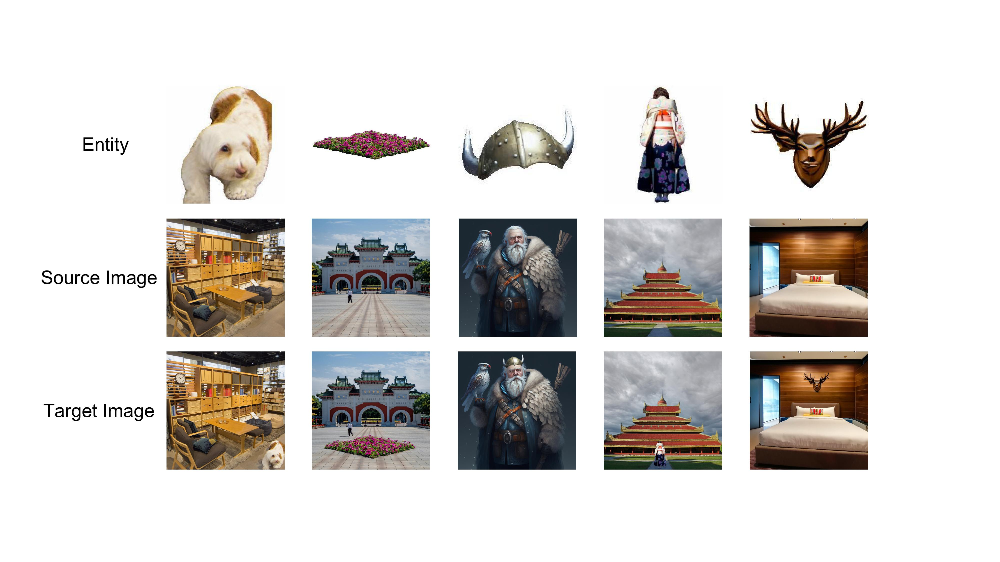
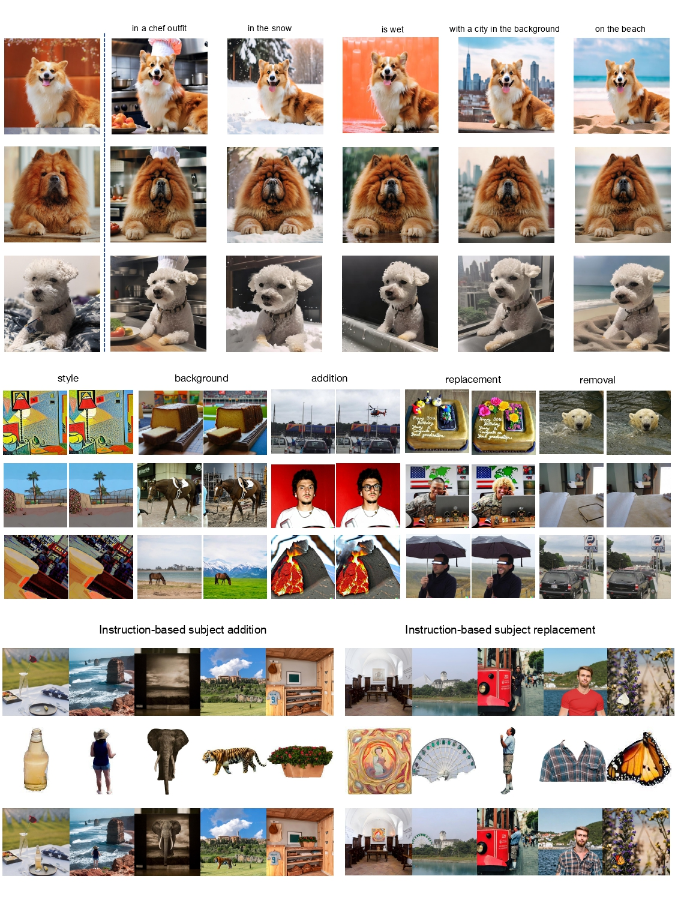

# MIGE: Mutually Enhanced Multimodal Instruction-Based Image Generation and Editing
Implementation code of the paper **[MIGE: Mutually Enhanced Multimodal Instruction-Based Image Generation and Editing](https://arxiv.org/abs/2502.21291)**


***
## 📌 News
[2507] 🎉 Our paper has been accepted to ACM MM 2025!

We’re thrilled to announce that our paper has been accepted to ACM International Conference on Multimedia 2025.
See you in Ireland this October! 🇮🇪
***
## ⚡ TL;DR
MIGE is a unified framework for both subject-driven image generation and instruction-based image editing, bridging them via multimodal instructions and joint training.

🚀 Mutual Enhancement: Treats generation and editing as complementary tasks, improving both through unified learning. **First to prove the mutual enhancement between the two tasks**.

🧩 Compositional Power: Unlocks new capabilities like instruction-based subject-driven editing, a challenging and novel task.

📊 Strong Results: Achieves state-of-the-art performance on multiple benchmarks (including the new proposed MIGEBench) with just 2.28M training samples.

## Quick Start

### 1. Set Up Python Environment

We recommend using Python version 3.9.2 and setting up a virtual environment for this project.

1. **Check Python version:**
    ```bash
    python --version  # Should be Python 3.9.2
    ```

2. **Create and activate a virtual environment:**
    ```bash
    python3 -m venv mige
    source mige/bin/activate
    ```

3. **Install required dependencies:**
    ```bash
    pip install torch==2.1.1 torchvision==0.16.1 torchaudio==2.1.1 --index-url https://download.pytorch.org/whl/cu118
    cd MIGE
    pip install -r requirements.txt
    ```

### 2. Install System Libraries

If you encounter any of the following errors, you can install the required system libraries.

`ImportError: libGL.so.1: cannot open shared object file: No such file or directory`

Solution:
```bash
sudo apt-get update
sudo apt-get install -y libgl1-mesa-glx
sudo apt-get install -y libglib2.0-0
```

`OSError: libcudart.so.11.0: cannot open shared object file: No such file or directory`

Solution:
```bash
pip uninstall -y torch torchvision torchaudio
pip install --no-cache-dir torch==2.1.1 torchvision==0.16.1 torchaudio==2.1.1 --index-url https://download.pytorch.org/whl/cu118
```

## Data Format

Example data for the following types is provided in the `example_data` folder:

- `subject-driven`
- `instruction-based edit`
- `instruction-based subject-driven edit (replace)`

### Data Preprocessing

To train the model, you need to extract features using the `tools/extract_features.py`.

1. **Create separate folders** for the following entities: `vae_entity_image`, `vae_source_image`, and `vae_target_image` to store the corresponding VAE features.

2. Modify the loop `for item in items['source_path']:` (line 44) to specify the type of image being processed.

3. It is recommended to store data for different tasks in **separate JSON files**. The `example_data.json` file contains mixed data types for demonstration purposes.

## Training

We provide an `accelerate_config.yaml` file for single-node multi-GPU/multi-node multi-GPU training. After modifying the `configs/config_mige.py` file, run the training script:

```bash
sh train_scripts/train_mige.sh
```

For convenience, we have uploaded all the models mentioned in the paper, including `bert-base-uncased`, `sd-vae-ft-ema`, `t5-v1_1-xxl`, `PixArt-XL-2-512x512`, `blip2_pretrained_flant5xxl`, `eva_vit_g`, along with the final MIGE model (`model.pth`), to [Hugging Face](https://huggingface.co/EurekaTian/MIGE). Download them and put in `output/pretrained_models`.

## Inference

Inference scripts for **subject-driven image generation**, **instruction-based image editing**, and **instruction-based subject-driven image editing** are available in `MIGE/infer_scripts`. Here are some key points for performing inference:

- Replace the dataset paths in the `emuedit` dataset JSON file.
- Follow the batch size (`bs`) in the benchmark settings. The model uses `torch.randn` for initialization. Even though the seed is controlled, the latent noise used is dependent on the batch size. For instance, with `bs=10`, cases 1, 11, and 21 will use the first latent noise. To replicate our results exactly, follow the provided JSON file and settings.
- For instruction-based subject-driven image editing, we provide a file `MIGEBench_extract_entity.py` to extract the entity in generated images, which can be used to evaluate the model's entity-preserving ability on **MIGEBench**. To set up Grounded SAM, follow the instructions in the [GroundingDINO GitHub](https://github.com/IDEA-Research/GroundingDINO) and the [Segment Anything GitHub](https://github.com/facebookresearch/segment-anything).

## MIGEBench

The following benchmark files are available on [Hugging Face](https://huggingface.co/datasets/EurekaTian/MIGEBench):

- `MIGEbench`
    - `add_bench.json`
    - `replace_bench.json`

### Data Structure

- **Add task**:
    - `add_entity`
    - `add_mask`
    - `add_source`
    - `add_target`

- **Replace task**:
    - `replace_entity`
    - `replace_mask`
    - `replace_source`
    - `replace_target`


## More Examples

